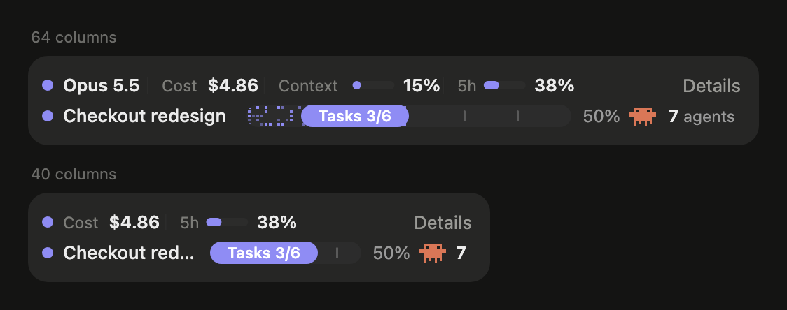

# sgs-kit

Skills and mods for [Claude Code](https://claude.com/claude-code), in one place. Every item is a standalone plugin under `plugins/`: install only what you need.

sgs-kit is a fork of [johnnyvizz/claude-kit](https://github.com/johnnyvizz/claude-kit). savvy-flow is carried over as is; savvy-progress adds a session row and a session panel on top of upstream (see [What the fork adds](#what-the-fork-adds)). Upstream changes are merged by hand.

| Plugin | Type | What it does |
| --- | --- | --- |
| [savvy-flow](plugins/savvy-flow) | skill + agents | `/savvy-flow <task>`: the session model plans, delegates to tiered worker subagents and reviews their work. |
| [savvy-progress](plugins/savvy-progress) | mod | A session row above the prompt in every session (cost, tokens, context, usage limits, time), a session panel with the details, and a progress bar plus live agents list for savvy-flow and any subagents. |

savvy-flow and savvy-progress work on their own and light up together: with both installed, the flow drives the progress bar and workers report their progress to the panel.

## What savvy-progress looks like

The session row and a savvy-flow progress bar above the prompt, in the desktop Code tab:


The **Details** button opens the session panel: cost split, usage limits, context window, tokens, cost by model and a card of running, finished and planned subagents, each savvy tier in its own costume.


The row follows the window: on a narrow one it drops figures by priority, then the word "agents", then the percent.



The images are drawn by the mod's own rendering code with sample data.

## What the fork adds

savvy-progress `1.2.0-sgs.*`:

- **Session row, always on.** Model, cost, tokens, context fill, the 5-hour and 7-day usage limits and session time, above the prompt in every session. Figures drop by priority as the row narrows; gauges turn amber at 70 % and red at 90 %, with the figure always printed.
- **Session panel** (the row's **Details** button or `/agents-info`): cost with the main session / subagent split, usage limits with reset times, the context window by category, tokens by kind with the cache hit rate, cost by model, then the subagents.
- **Cost** is Claude Code's own ledger (what `/cost` shows) when the host keeps one, else an API-equivalent estimate from token counts. Either way it is not a bill, which is the useful reading on a subscription.
- **Planned tasks** may name their `model` and `effort`, so a Haiku or Sonnet task is not shown as Opus.
- **Turkish** panel language (`language: tr`), beside English and Russian.

## Install

### From the marketplace

In Claude Code:

```
/plugin marketplace add Phalegethon/sgs-kit
/plugin install savvy-flow@sgs-kit
/plugin install savvy-progress@sgs-kit
```

Restart the session afterwards. Plugin skills and agents are namespaced: the skill is `/savvy-flow:savvy-flow`, the agents `savvy-flow:savvy-careful` and so on.

### Updating

Plugins from a third-party marketplace such as sgs-kit do not update on their own: Claude Code turns background auto-update on only for Anthropic's official marketplaces, and a marketplace cannot turn it on for you. Either switch it on once, or update by hand.

**Auto-update, once:** in `/plugin`, go to **Marketplaces**, select **sgs-kit** and select **Enable auto-update**. Claude Code then checks a few minutes after your first message in a session and says `Plugin updated: <name> · Run /reload-plugins to apply`; the new version also loads on your next launch.

The toggle is only there in a terminal `claude` session. The desktop app starts Claude Code with `DISABLE_AUTOUPDATER=1`, which hides the toggle and turns the background update off, so in the desktop app the plugin page keeps showing the old version and its **Update** button stays greyed until the catalog is refreshed. There, update by hand as below, or switch auto-update on from a terminal session: it updates the plugins on disk, and the desktop app loads the new version in its next session.

**By hand:** refresh the catalog, then update each plugin:

```bash
claude plugin marketplace update sgs-kit
```

```bash
claude plugin update savvy-progress@sgs-kit
```

```bash
claude plugin update savvy-flow@sgs-kit
```

Then run `/reload-plugins` or start a new session. Sessions already open keep the version they started with.

Any earlier sgs-kit version updates this way: the marketplace and plugin names have not changed since it was published. A plugin loaded by hand with `--plugin-dir` or `CLAUDE_CODE_PLUGIN_DIRS` updates with `git pull` instead (see below).

If you already have the upstream plugins from `claude-kit`, keep one copy of each enabled: both register the same tools.

```
/plugin disable savvy-progress@claude-kit
/plugin disable savvy-flow@claude-kit
```

### By hand

```bash
git clone https://github.com/Phalegethon/sgs-kit.git ~/sgs-kit
```

**A skill** (no plugin system involved, names stay short: `/savvy-flow`, `savvy-careful`): copy its folders into your Claude Code config.

```bash
cp -R ~/sgs-kit/plugins/savvy-flow/skills/savvy-flow ~/.claude/skills/
```

```bash
cp ~/sgs-kit/plugins/savvy-flow/agents/*.md ~/.claude/agents/
```

**A mod**: load the folder for one session,

```bash
claude --plugin-dir ~/sgs-kit/plugins/savvy-progress
```

or for every session (including the desktop app) through `env` in `~/.claude/settings.json`. Several folders are separated with `:`; if the variable is already set, append to it rather than replacing it:

```json
{
  "env": {
    "CLAUDE_CODE_PLUGIN_DIRS": "~/sgs-kit/plugins/savvy-progress"
  }
}
```

`git pull` in the clone updates a mod loaded this way; copied skills need copying again.

Mods are built on function hooks (`hooks/register.tsx`), an early-access Claude Code API: tested on Claude Code 2.1.295, and it may change between releases. If a mod installed from the marketplace does not show up, load it by hand as above.

## Layout

```
.claude-plugin/marketplace.json   the catalog `/plugin marketplace add` reads
plugins/<name>/
  .claude-plugin/plugin.json      manifest
  skills/<skill>/SKILL.md         a skill
  agents/*.md                     subagents it ships
  hooks/hooks.json                a mod: points at the hooks module
  hooks/register.tsx              a mod: the module itself
  types/index.d.ts                a mod: its $.state contract
  tests/*.test.tsx                a mod: `claude plugin test plugins/<name>`
```

Check a plugin before publishing: `claude plugin validate plugins/<name>` and `claude plugin test plugins/<name>`, and the catalog with `claude plugin validate .`.

## Credits and license

savvy-flow and savvy-progress were written by [johnnyvizz](https://github.com/johnnyvizz) in [claude-kit](https://github.com/johnnyvizz/claude-kit); the session row, the session panel and the Turkish strings are this fork's. MIT, see [LICENSE](LICENSE).
