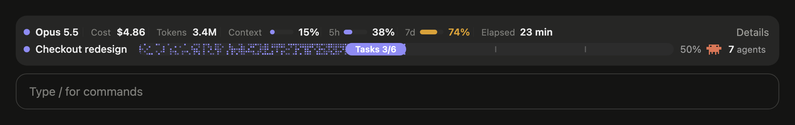
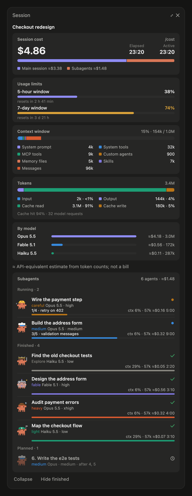

# savvy-progress

> **sgs-kit fork (1.2.0-sgs.6)** of savvy-progress from [johnnyvizz/claude-kit](https://github.com/johnnyvizz/claude-kit).
> It adds an always-on **session row** above the prompt (model, cost, tokens, context fill, the 5-hour and 7-day
> limits, session time) whose **Details** button opens the **session panel**: cost with the main session /
> subagent split, usage limits with reset times, the context window by category, tokens by kind with the cache
> hit rate and cost by model, above the subagents. Cost is Claude Code's own ledger (/cost) when the host keeps
> one, else an API-equivalent estimate from token counts; never a bill. Planned tasks may name their
> `model`/`effort`, and the panel speaks Turkish (`language: tr`).

A Claude Code mod: a session row above the prompt, a progress bar and a live panel of the session and its subagents. Made for the [savvy-flow](../savvy-flow) skill, and useful with any subagents.





Drawn by the mod's own rendering code with sample data; more in the [repository README](../../README.md#what-savvy-progress-looks-like).

- **Session row** (fork): always on; figures drop by priority as the band narrows, gauges turn amber at 70 % and red at 90 %, and the figure is always printed.
- **Progress bar**: the flow's title, phase, accepted tasks out of planned, and the flow's crew size (its runs plus the tasks still planned) beside the crab. The band follows the window: on a narrow one the row drops the word "agents", then the percent, then shortens the title. A finished flow shows Done until your next prompt, then leaves; there is no dismiss, so nothing can hide a running flow. Subagents belong to the session: a new flow keeps the runs of earlier ones, so their cost stays in the totals. It appears once something reports progress (savvy-flow does) or a `savvy-*` worker starts.
- **Session panel** (`/agents-info` or the row's Details button toggles it): the session cards above, then a subagents card of running, finished and planned subagents with model, effort, task progress, context, estimated cost and time, with Collapse and Hide finished under it. Working crabs walk, and each savvy tier animates its prop: the astronaut floats, the detective sweeps the magnifier, the engineer turns the wrench, the chef tosses the omelette, the racer runs with a fluttering flag. `prefers-reduced-motion` stops them.

## Tools it adds

- `mcp__savvy-progress__progress`: the orchestrator reports the plan, phase and accepted tasks (each task may name its `model` and `effort`).
- `mcp__savvy-progress__step`: a worker reports its own steps (`done`, `total`, `note`). A worker that does not report shows its context fill in grey instead.

Cost is a rough estimate from token counts and a built-in per-model price table (`PRICES` in `hooks/register.tsx`), not a bill.

## Settings

`language`: `auto` (default), `en`, `ru` or `tr`. `auto` follows Claude Code's `language` setting, then the system locale, and falls back to English. Set it in `/config`, or, for a mod loaded by hand, in `~/.claude/settings.json`:

```json
{ "pluginConfigs": { "savvy-progress": { "options": { "language": "ru" } } } }
```

Install instructions are in the [repository README](../../README.md).
